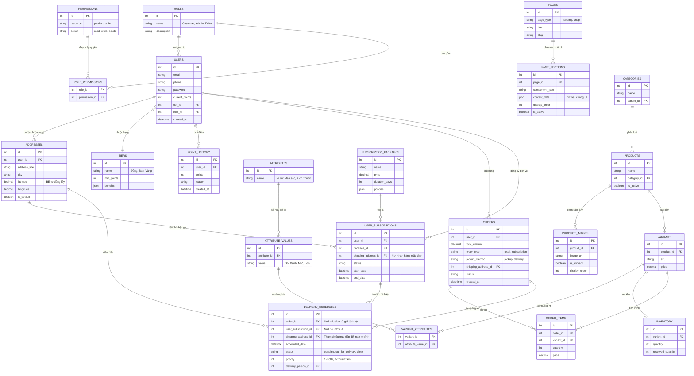

# Thiết Kế Cơ Sở Dữ Liệu - Hệ Thống Bán Bán Hoa (D2C)

Dựa trên yêu cầu của bạn, tôi đã cập nhật lại cấu trúc hệ thống: phân tách thuộc tính (attribute) ra thành bảng chuẩn rời (không dùng JSON), thêm hình ảnh sản phẩm, bổ sung tọa độ địa lý (vĩ độ, kinh độ) cho phần địa chỉ, và tích hợp một hệ thống phân quyền (RBAC) chi tiết cho cả khách hàng và quản trị viên.

## Đề Xuất Cấu Trúc Cơ Sở Dữ Liệu (Database Architecture)

Hệ thống được chia thành các phân hệ chính sau:

### 1. Phân hệ Phân quyền & Quản trị Người dùng (Auth & RBAC)
Sử dụng mô hình RBAC (Role-Based Access Control) để cấp quyền chi tiết.
- **`ROLES`**: Nhóm quyền (Ví dụ: `Customer`, `Super_Admin`, `Content_Editor`, `Order_Manager`).
- **`PERMISSIONS`**: Chi tiết tính năng hạn chế (Ví dụ: Resource `product`, Action `write` / `del`).
- **`ROLE_PERMISSIONS`**: Bảng trung gian ánh xạ Quyền hạn vào Nhóm quyền.
- **`USERS`**: Thông tin người dùng. `role_id` sẽ quyết định người dùng là Admin nhóm nào hay chỉ là Khách hàng.

### 2. Phân hệ Quản lý Địa chỉ & Loyalty (Addresses & Gamification)
- **`ADDRESSES`**: Chứa thông tin giao hàng bằng văn bản (`address_line`, `city`) kèm theo **`latitude`** và **`longitude`** (Backend tự động resolve theo text đã nhập).
- **`TIERS`**: Danh mục hạng thành viên (Nhỏ/Vừa/Lớn).
- **`POINT_HISTORY`**: Lịch sử cộng/trừ điểm thưởng. 

### 3. Phân hệ Cấu hình Giao diện (CMS - Landing Page & Web Shop)
- **`PAGES`**: Lưu trữ danh sách các trang.
- **`PAGE_SECTIONS`**: Các khối giao diện động trên trang, lưu cấu trúc theo `JSON` để Frontend tự do định hình nội dung.

### 4. Phân hệ Sản phẩm & Thuộc tính (Products & Dynamic Attributes)
Đã chuyển đổi hoàn toàn sang cấu trúc RDBMS thuần để lưu thuộc tính.
- **`CATEGORIES`**: Danh mục hoa.
- **`PRODUCTS`**: Sản phẩm gốc.
- **`PRODUCT_IMAGES`**: Hình ảnh sản phẩm (có thể chọn ảnh nào là `is_primary` - ảnh đại diện).
- **`VARIANTS`** (SKU): Các biến thể cụ thể (VD: Bó 10 bông, giá 500k).
- **`ATTRIBUTES`** & **`ATTRIBUTE_VALUES`**: Danh sách thuộc tính (VD: Thuộc tính "Kích thước" -> Giá trị: "Vừa", "Lớn").
- **`VARIANT_ATTRIBUTES`**: Bảng trung gian móc nối Variant với những giá trị thuộc tính tương ứng.

### 5. Phân hệ Giỏ hàng & Đơn hàng Bán lẻ (Cart & Order)
- Trạm trung chuyển tạo đơn thanh toán: **`CARTS`**, **`CART_ITEMS`**, **`ORDERS`**, **`ORDER_ITEMS`**.

### 6. Phân hệ Gói Dịch Vụ Hoa (Subscription)
Cho phép khách mua kỳ hạn.
- **`SUBSCRIPTION_PACKAGES`**: Cấu hình các loại gói với các chính sách.
- **`USER_SUBSCRIPTIONS`**: Quản lý gói mà user đang tham gia, được gán `shipping_address_id` mặc định để hệ thống tự biết nơi giao.

### 7. Phân hệ Lịch trình Giao hàng & Tồn kho (Logistics & Inventory)
- **`INVENTORY`**: Quản lý SL xuất nhập.
- **`DELIVERY_SCHEDULES`**: Điều phối ngày giao, lộ trình. Bản ghi có gắn trực tiếp `shipping_address_id` để query tọa độ (lat/long) làm thuật toán map lộ trình cực nhanh mà không cần JOIN nhiều bảng. Ưu tiên lộ trình gói định kỳ, hỏa tốc đối với đơn lẻ theo giờ đặt.

---

## Vẽ Sơ đồ Thực thể Liên kết (ERD)

## User Review Required
> [!IMPORTANT]
> - Các thuộc tính biến thể hiện tại đã được tách thành `ATTRIBUTES`, `ATTRIBUTE_VALUES`, và `VARIANT_ATTRIBUTES` để dễ truy vấn qua SQL và lọc (phục vụ filter dễ dàng trên giao diện).
> - Tính năng tọa độ (`latitude`, `longitude`) đã được thiết lập ở trong bảng **`ADDRESSES`**. Các tọa độ này sẽ sử dụng trong lộ trình cho Entity **`DELIVERY_SCHEDULES`**.
> - Khả năng phân quyền chi tiết đã được áp dụng với RBAC (`ROLES`, `PERMISSIONS`). Quản trị viên (Admin) hoàn toàn có thể được giới hạn quyền truy cập chi tiết (chỉ đọc Order, hoặc được viết Product...).
> 
> Nếu bản cập nhật ERD này đã phản ánh chính xác các mong muốn của bạn, vui lòng xác nhận để tôi có thể kết thúc pha thiết kế. Nếu bạn có bất kì thay đổi nào thêm, cứ cho tôi biết nhé!
